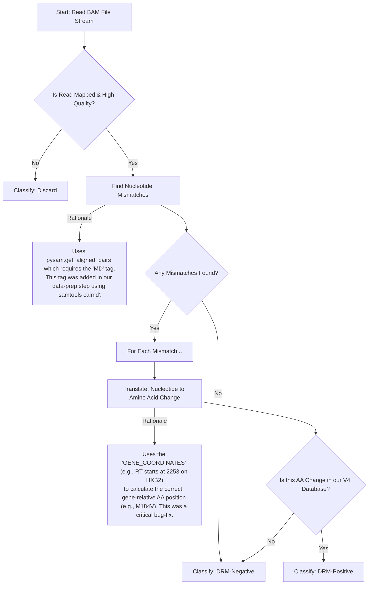

# HIV Drug Resistance (DRM) Real-Time Simulation Pipeline

## 1\. Project Overview

### 1.1. The Goal (The "Why")

This project is the foundational core for a **real-time HIV drug resistance (DRM) detection pipeline**. The ultimate goal is to deploy this system on an NVIDIA Jetson AGX Orin, interfacing directly with an Oxford Nanopore sequencer. By using the "Read-Until" API, this system will be able to analyze RNA strands *as they are being sequenced*. It can then "unblock" the nanopore (eject the strand) if it's not from a relevant HIV gene, or command the sequencer to "continue" if it detects a sequence of interest (i.e., one containing a potential drug resistance mutation).

This selective sequencing approach will dramatically **increase the efficiency and speed of clinical diagnostics**, allowing for the rapid identification of antiviral drug resistance from a patient sample.

### 1.2. The Strategy (The "How")

Before deploying a system in a live, time-sensitive, and expensive sequencing run, we must first prove that its core logic is sound.

The work in this repository represents this critical **offline simulation and validation phase**. We have built a complete, end-to-end pipeline that simulates a real-time stream of data and applies our full biological classification algorithm. This allows us to rigorously test, debug, and validate our logic using pre-existing, real-world sequencing data.

## 2\. What We Have Done (The "What")

We have successfully built and validated a two-part system: **a data-processing pipeline** and **a simulation pipeline**.

### 2.1. Part 1: The Data-Processing Pipeline

The accuracy of our classifier depends on its "answer key"—the DRM database. We built a robust script (`build_definitive_database_v2.py`) to create this database from a messy, real-world CSV file (`synthetic_profiles.csv`).

**Why this was critical:**

  * The source data was in a "wide" format, unsuitable for fast lookups.
  * The mutation data was stored in inconsistently formatted strings (e.g., `"['75T', '54A']"`).

**Our Solution:**

1.  **Transform:** The script uses `pandas` to "melt" the data from a wide to a long format.
2.  **Clean:** It uses a robust, multi-step regular expression cleaner to extract all valid mutation codes, ignoring extra brackets, quotes, and spaces.
3.  **Map:** It applies a standard biological rule to map each mutation to its correct gene. **This was a key insight**:
      * Mutations at Amino Acid position **1-99** are mapped to **Protease (PR)**.
      * Mutations at Amino Acid position **100-560** are mapped to **Reverse Transcriptase (RT)**.
4.  **Build:** The final output is `drm_database_definitive.json`, a highly efficient, gene-centric JSON file structured for instant, O(1) lookups.

**Final Database Structure:**

```json
{
  "PR": {
    "V82A": {
      "drugs": [
        { "name": "FPV/r", "score": "Pot_R" }
      ]
    }
  },
  "RT": {
    "M184V": {
      "drugs": [
        { "name": "3TC", "score": "High_R" },
        { "name": "FTC", "score": "High_R" }
      ]
    },
    "K103N": {
      "drugs": [
        { "name": "EFV", "score": "High_R" }
      ]
    }
  }
}
```

### 2.2. Part 2: The Core Simulation Pipeline

This is the "engine" of the project (`run_final_pipeline.py`). It simulates a data stream and runs our full biological analysis on every read.

**Workflow & Algorithmic Rationale:**



