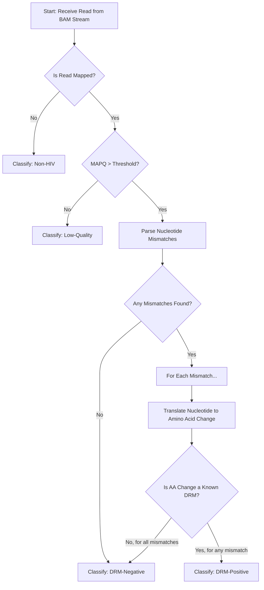

# HIV Drug Resistance Mutation (DRM) Enrichment Pipeline: A Real-Time Simulation Core

## 1\. Project Overview

### 1.1. Introduction

This repository contains the core logic for a real-time HIV Drug Resistance Mutation (DRM) enrichment pipeline. The ultimate goal of this project is to create a system that can be deployed on an **NVIDIA Jetson AGX Orin** and integrated with an **Oxford Nanopore Technologies (ONT) MinION sequencer** via the **Read-Until API**. This will enable the selective sequencing of HIV RNA fragments that contain known DRMs, maximizing the efficiency and speed of diagnostic workflows.

This initial version of the pipeline is a **critical offline simulation and validation tool**. It is designed to process existing, pre-aligned sequencing data from BAM files to rigorously test and validate the entire algorithmic workflow before deployment in a live, real-time environment.

### 1.2. The Scientific Problem: HIV Drug Resistance

Human Immunodeficiency Virus (HIV) is a retrovirus that, if left untreated, can lead to Acquired Immunodeficiency Syndrome (AIDS). While modern Antiretroviral Therapy (ART) is highly effective, the virus's high mutation rate can lead to the development of **Drug Resistance Mutations (DRMs)**. These are specific genetic changes in the virus that reduce the effectiveness of ART drugs.

Clinically, it is crucial to identify which DRMs a patient's viral population carries to select the most effective treatment regimen. Traditional methods can be time-consuming. Nanopore sequencing offers a path to rapid analysis, and by coupling it with real-time decision-making, we can dramatically accelerate this process.

### 1.3. The Technological Solution: Nanopore Read-Until

The ONT Read-Until API is a revolutionary technology that allows a user's script to analyze the first \~400 base pairs of a DNA/RNA molecule *as it is being sequenced*. Based on this initial analysis, the script can send a command back to the sequencer:

  * **`continue_sequencing`**: If the molecule is interesting (e.g., contains a DRM), the sequencer continues reading it to get a high-quality result.
  * **`unblock`**: If the molecule is not of interest, the sequencer ejects it from the nanopore and immediately begins sequencing a new molecule.

This real-time decision-making, or "enrichment," allows us to focus the limited time and resources of a sequencing run exclusively on the most diagnostically relevant genetic material.

### 1.4. Rationale for a Simulation-First Approach

Building and testing software for a live sequencing environment is expensive, complex, and time-consuming. The design philosophy of this project is to follow an agile, industry-standard development model by first building a robust and fully validated simulation pipeline.

This approach allows us to:

  * **Perfect the Core Logic:** Develop and debug the complex biological translation and database lookup algorithms in a controlled, offline environment.
  * **Use Real-World Data:** Validate the pipeline using large, realistic BAM files from previous sequencing runs.
  * **Decouple Development:** Separate the core algorithmic challenges from the complexities of interacting with the live sequencer API.
  * **Ensure Scientific Accuracy:** Guarantee that the classification logic is correct before applying it in a time-sensitive, real-time setting.

-----

## 2\. Project Architecture and Structure

The project is organized into a standard Python package structure to ensure modularity, maintainability, and scalability.

```
hiv_drm_enricher/
│
├── data/
│   ├── synthetic_df.csv            # Raw, messy DRM data from a collaborator
│   ├── drm_database.json           # The clean, processed, final DRM database
│   ├── HIV_reference_dummy.fasta   # A small FASTA file for testing
│   └── sample_70.sorted.bam        # Example input sequencing data (user-provided)
│
├── scripts/
│   ├── build_drm_database.py       # Standalone script to parse the CSV and create the JSON DB
│   ├── simulate_streamV2.py        # The main entry point to run the full simulation pipeline
│   └── classifierV2.py             # (Contains core logic, imported by the main script)
│
├── src/
│   └── hiv_drm_enricher/
│       ├── __init__.py             # Makes the directory a Python package
│       ├── streaming.py            # Module for simulating the data stream from a BAM file
│       └── classifierV2.py         # The core classification logic module
│
├── environment.yml                 # Conda environment definition for reproducibility
├── .gitignore                      # Specifies files for Git to ignore
└── README.md                       # This file
```

### 2.1. Directory Rationale

  * **`src/hiv_drm_enricher/`**: This is the heart of the project, containing the core, reusable Python modules. It is structured as an installable package.
  * **`scripts/`**: Contains user-facing, executable scripts that use the modules from `src/` to perform specific tasks, like building the database or running the simulation. This separates the "engine" from the "driver's controls."
  * **`data/`**: A dedicated directory for all input data and processed outputs. This directory is intentionally excluded from version control via `.gitignore` to prevent large files (like BAMs) from being committed to the repository.

-----

## 3\. Setup and Installation

This project is designed to be run within a Linux environment. For Windows users, the **Windows Subsystem for Linux (WSL)** is the recommended and required solution, as it provides native support for critical bioinformatics tools distributed via the Bioconda channel.

### 3.1. Prerequisites

  * **Git:** For version control.
  * **Conda:** For package and environment management. We recommend installing [Miniconda](https://www.google.com/search?q=httpss://docs.conda.io/en/latest/miniconda.html).
  * **(Windows Users)** [Windows Subsystem for Linux (WSL)](https://www.google.com/search?q=httpss://learn.microsoft.com/en-us/windows/wsl/install) with an Ubuntu distribution.

### 3.2. Installation Steps

1.  **Clone the Repository:**

    ```bash
    git clone <your-repository-url>
    cd hiv_drm_enricher
    ```

2.  **Create and Activate the Conda Environment:**
    The `environment.yml` file declaratively lists all necessary dependencies, ensuring a reproducible environment on any machine.

    ```bash
    # Create the environment from the file
    conda env create -f environment.yml

    # Activate the new environment
    conda activate hiv_drm_enricher
    ```

    This command creates an environment named `hiv_drm_enricher` and installs the following key libraries:

      * **`pysam`**: A powerful wrapper for HTSlib/samtools, used for reading and manipulating BAM files with high efficiency.
      * **`pandas`**: An essential data science library used here for robustly parsing the complex CSV data source.
      * **`mappy`**: A Python wrapper for the industry-standard Minimap2 aligner. While not used in the current simulation, it is included in preparation for the real-time alignment phase.

-----

## 4\. Data Preparation: Building the DRM Database

A high-quality, comprehensive DRM database is the foundation of this pipeline. After discovering that publicly available data files from sources like the Stanford HIVDB were unstable or difficult to access programmatically, we opted for a more robust solution using a collaborator-provided CSV file.

### 4.1. The Source Data (`synthetic_df.csv`)

The source of truth for this pipeline is `data/synthetic_df.csv`. This file contains a wide-format table where rows represent complex mutation patterns and columns represent different ART drugs.

### 4.2. The Processing Pipeline (`build_drm_database.py`)

The `scripts/build_drm_database.py` script is a standalone data processing tool designed to convert the messy, complex `synthetic_df.csv` into a clean, efficient, and machine-readable format. It performs the following steps:

1.  **Reads the CSV:** It loads the source file, with a built-in **"Test Mode"** to process only the first 1000 rows for rapid testing and validation of the parsing logic.
2.  **Transforms Data Structure:** It converts the "wide" table into a "long" format using `pandas.melt`, which is much easier to process programmatically.
3.  **Parses Complex Mutations:** It uses a robust Regular Expression (regex) engine to parse the `mutations` column. This logic is designed to handle messy, real-world formatting, including extra quotes and combination mutations (e.g., `'54V AND 82L'`).
4.  **Builds the Final Database:** It constructs a nested Python dictionary, which is then saved as `data/drm_database.json`.

### 4.3. The Final Database (`drm_database.json`)

The output is a JSON file structured for **maximum lookup efficiency**. The nested dictionary design allows the main pipeline to check for a DRM in near-constant time, which is critical for real-time performance.

**Structure Rationale:**

```json
{
  "53": { // Key 1: Nucleotide position (0-based)
    "V": {  // Key 2: Alternate Amino Acid
      "aa_change": "54V", // Metadata: 1-based Amino Acid change
      "drugs": [          // A list of all drugs affected by this mutation
        {
          "name": "ATV/r",
          "score": "Pot_R"
        },
        // ... more drugs
      ]
    }
  },
  // ... more positions
}
```

To check if a mutation is a DRM, the classifier only needs to perform two fast dictionary lookups: `db.get(position, {}).get(alt_aa)`.

-----

## 5\. The Algorithmic Workflow

The core of this project is the multi-step algorithm executed for every single read. This process is designed to quickly filter out irrelevant data and perform a deep biological analysis on promising candidates.

### 5.1. Workflow Flowchart



### 5.2. Detailed Algorithmic Steps

#### Step 1: Data Streaming Simulation (`streaming.py`)

The pipeline begins in `simulate_streamV2.py`, which calls the `stream_bam_as_reads` function. This function uses `pysam` to open the input BAM file and creates a **Python generator**. This is a highly memory-efficient technique that yields one read at a time, perfectly simulating the one-by-one nature of a real-time data stream without ever loading the entire 5GB+ file into memory.

#### Step 2: Core Classification (`classifierV2.py`)

For each read yielded by the stream, the `classify_read_verbose` function is called.

  * **A. Alignment & Quality Validation:** The first two checks are rapid filters. The function checks `read.is_unmapped` and `read.mapping_quality` to immediately discard reads that are not from the HIV genome or are of poor alignment quality.

  * **B. Nucleotide Mismatch Identification:** The `parse_mismatches` function iterates through the read's alignment and identifies all single-base differences between the read's sequence and the reference genome.

  * **C. Biological Translation (The Core Innovation):** This is the most critical and complex step, performed by the `get_amino_acid_change` function. The pipeline elevates itself from simple string comparison to biological interpretation.

    1.  **What is a Codon?** In genetics, a **codon** is a sequence of three consecutive nucleotides that corresponds to a specific amino acid. Proteins are built from chains of amino acids.
    2.  **Identify the Codon:** For a given nucleotide mismatch, the function calculates where it falls within the three-letter codon (position 0, 1, or 2).
    3.  **Translate Codons:** It extracts the original codon from the reference genome and constructs the new, mutated codon. Using a standard genetic code table, it translates both codons into their respective amino acids.
    4.  **Determine the Change:** If the translation results in a different amino acid, the function has successfully identified an **amino acid change** (e.g., K103N, meaning the amino acid at position 103 changed from Lysine (K) to Asparagine (N)).

  * **D. DRM Database Lookup:** The pipeline then uses the identified amino acid change to query the loaded `drm_database.json`. It checks if the nucleotide position and the new alternate amino acid exist as keys in the database.

  * **E. Final Classification:**

      * If **any** mismatch in the read translates to a known DRM in the database, the read is immediately classified as **`DRM-Positive`**, and no further analysis is needed.
      * If the read is high-quality and mapped but contains no known DRMs (or its mismatches don't result in an amino acid change), it is classified as **`DRM-Negative`**.

-----

## 6\. How to Run the Simulation

1.  **Activate the Environment:**

    ```bash
    conda activate hiv_drm_enricher
    ```

2.  **Ensure Data is in Place:**

      * Make sure `data/drm_database.json` has been generated by the build script.
      * Make sure `data/HIV_reference_dummy.fasta` exists.
      * Make sure your input BAM file (e.g., `data/sample_70.sorted.bam`) is present and indexed.

3.  **Execute the Main Script:**
    Run the `simulate_streamV2.py` script, providing the path to your input BAM file.

    ```bash
    python scripts/simulate_streamV2.py --input_bam data/sample_70.sorted.bam --num_reads 100
    ```

    The script will print a detailed, step-by-step analysis for each read, showing how it arrives at its final classification.

-----

## 7\. Future Work and Next Steps

This simulation pipeline provides a robust and validated foundation. The next phases of the project will focus on transitioning from simulation to a real-time implementation.

1.  **Adopt the Correct Reference Genome:** The single most important next step for scientific accuracy is to replace `HIV_reference_dummy.fasta` with the actual reference FASTA file that was used to create the input BAM file. This will align the biological context of the simulation with the real data.

2.  **Integrate `mappy` for Real-Time Alignment:** The current logic will be adapted to handle unaligned reads. A new function will take a raw sequence string from the (simulated) Read-Until API and use `mappy` to perform an in-memory alignment. The resulting alignment object, which has a similar structure to a `pysam` read, will then be passed to the existing classification logic.

3.  **API Integration:** The script will be refactored to conform to the ONT Read-Until API, preparing it to receive data directly from the sequencing software.

4.  **Performance Optimization and Deployment:** The final phase will involve optimizing the pipeline for the ARM64 architecture of the NVIDIA Jetson AGX Orin and deploying it for live testing.